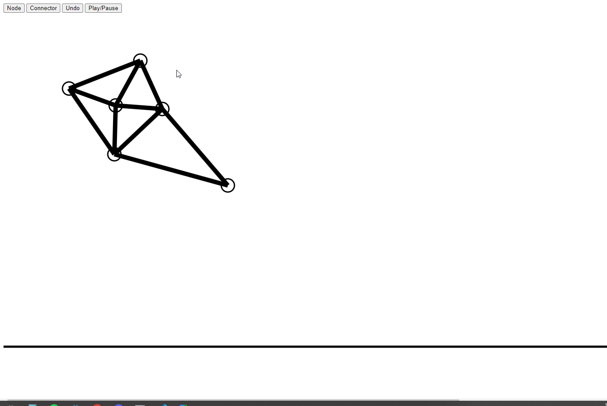
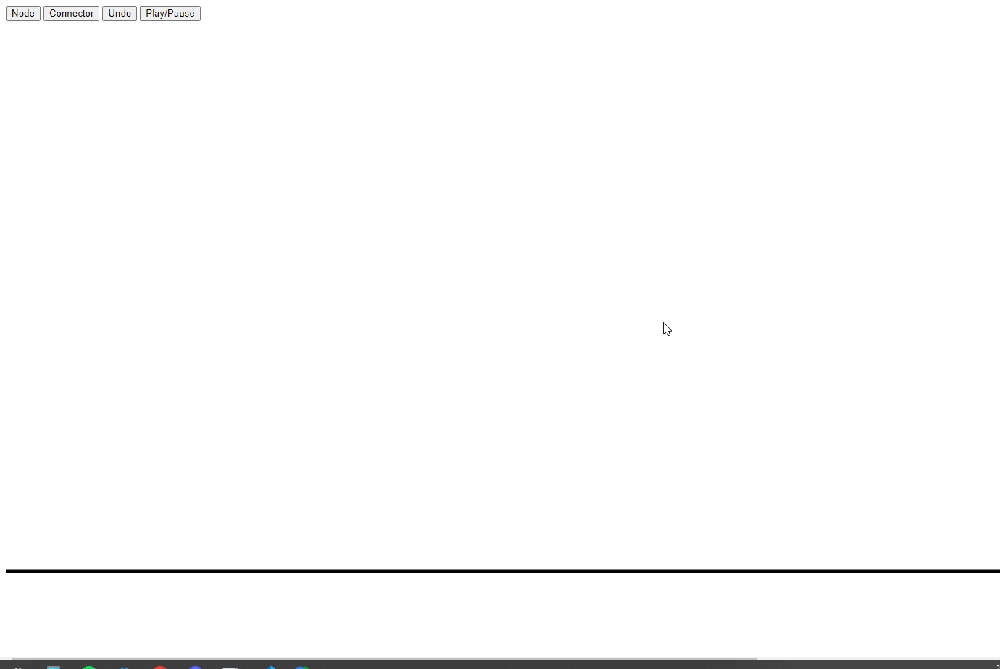

 

<h1>Nodes and Struts</h1>

 

    A very simple in browser 2D rigid body simulator. Allows the user to draw any sort of shape and observe the stress induced upon its components at impact. The struts display forces by changing colors and can even break if the force exceeds a threshold. 

<!-- ABOUT THE PROJECT -->
## About The Project

I built this project as a test of my skills and as part of my time teaching students the fundamentals of web design. I decided to stick to vanilla js, html, and css to make it easily approachable even for a beginner. This was intended as an introduction to using advanced mathmatics inside our code.
<!-- GETTING STARTED -->
## Getting Started

This project uses a simple html file. Just open it in any browser.
Click the node button to draw nodes, click the strut button and then two nodes to connect them. Build your 2D frame and click play to watch it smash to the ground!

### Installation
Simply get the repo and open it in the browser.

<!-- USAGE EXAMPLES -->
## Usage
Just for fun, great way to explore the first steps of creating a soft body physics system!

<!-- CONTRIBUTING -->
## Contributing

Contributions are what make the open source community such an amazing place to learn, inspire, and create. Any contributions you make are **greatly appreciated**.

If you have a suggestion that would make this better, please fork the repo and create a pull request. You can also simply open an issue with the tag "enhancement".
Don't forget to give the project a star! Thanks again!

1. Fork the Project
2. Create your Feature Branch (`git checkout -b feature/AmazingFeature`)
3. Commit your Changes (`git commit -m 'Add some AmazingFeature'`)
4. Push to the Branch (`git push origin feature/AmazingFeature`)
5. Open a Pull Request

(<a href="#readme-top">back to top</a>)

<!-- MARKDOWN LINKS & IMAGES -->
<!-- https://www.markdownguide.org/basic-syntax/#reference-style-links -->
